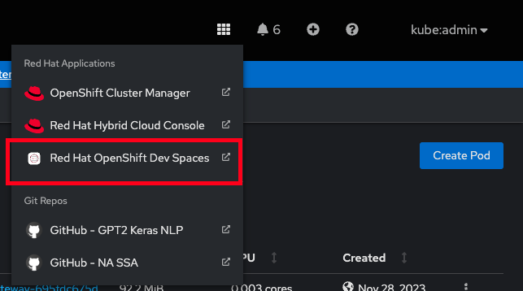
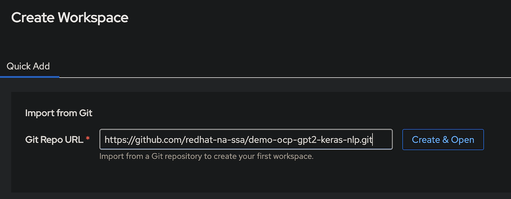

# Using OpenShift Dev Spaces for AI / ML Development

This repo demos helps show the value of OpenShift and OpenShift Dev Spaces as a platform for developing and deploying AI / ML workloads in a hybrid cloud.

## Installation

### Prerequisites

- [x] Red Hat OpenShift Cluster 4.10+
- [x] Cluster admin permissions

The following cli tools are required:

- `bash`, `git`
- `oc` - Download [mac](https://formulae.brew.sh/formula/openshift-cli), [linux](https://mirror.openshift.com/pub/openshift-v4/clients/ocp), [windows](https://mirror.openshift.com/pub/openshift-v4/clients/ocp/stable/openshift-client-windows.zip)
- `kubectl` (optional) - Included in `oc` bundle
- `kustomize` (optional) - Download [mac](https://formulae.brew.sh/formula/kustomize), [linux](https://github.com/kubernetes-sigs/kustomize/releases)

NOTE: `bash`, `git`, and `oc` are available in the [OpenShift Web Terminal](https://docs.openshift.com/container-platform/4.12/web_console/web_terminal/installing-web-terminal.html)

### From a terminal

```
# start in a bash shell
# (this means you mac users; zsh)
bash

# oc login to your cluster
# oc login --token=<yours> --server=https://<yours>
oc whoami

# git clone demo
git clone https://github.com/redhat-na-ssa/demo-ai-devspaces.git
cd demo-ai-devspaces

# run setup script
./scripts/bootstrap.sh

# expected results
  # Running: oc apply -k gitops
  # again...
  # again...
  # [OK]
```

### Uninstall

```
# WARNING: Be certain you want your cluster returned to a vanilla state
. ./scripts/bootstrap.sh

delete_demo
```

## Quickstart

- Launch DevSpaces from the waffle menu on the OCP Web Console

> [!NOTE]
> This may take 5+ mins post bootstrap setup



- `Create & Open` DevSpaces with the current repo



- Click the `Events` submenu to watch progress

> [!NOTE]
> This may take 12+ mins


- Open the [science/notebooks](science/notebooks) folder


- Run the [notebooks](science/notebooks/) in order

## Additional Resources

OpenShift Dev Spaces

- [OpenShift Dev Spaces - Overview](https://developers.redhat.com/products/openshift-dev-spaces/overview)
- [OpenShift Dev Spaces - Getting Started](https://developers.redhat.com/products/openshift-dev-spaces/getting-started)
- [OpenShift Dev Spaces - Video Overview (20m)](https://youtu.be/Jfd0F0-uYfU)
- [OpenShift Dev Spaces - Official Docs](https://access.redhat.com/documentation/en-us/red_hat_openshift_dev_spaces/3.9)
- [Configure Dev Spaces with Auth](https://eclipse.dev/che/docs/stable/end-user-guide/using-a-git-provider-access-token/)

Data Sets

- [Data Science Example - Fingerprint Prediction](https://github.com/redhat-na-ssa/datasci-fingerprint)
- [Data Science Example - Computer Vision](https://github.com/redhat-na-ssa/flyingthings)
- [Data Science Example - Keras GPT2 NLP](https://github.com/redhat-na-ssa/demo-ocp-gpt2-keras-nlp)
